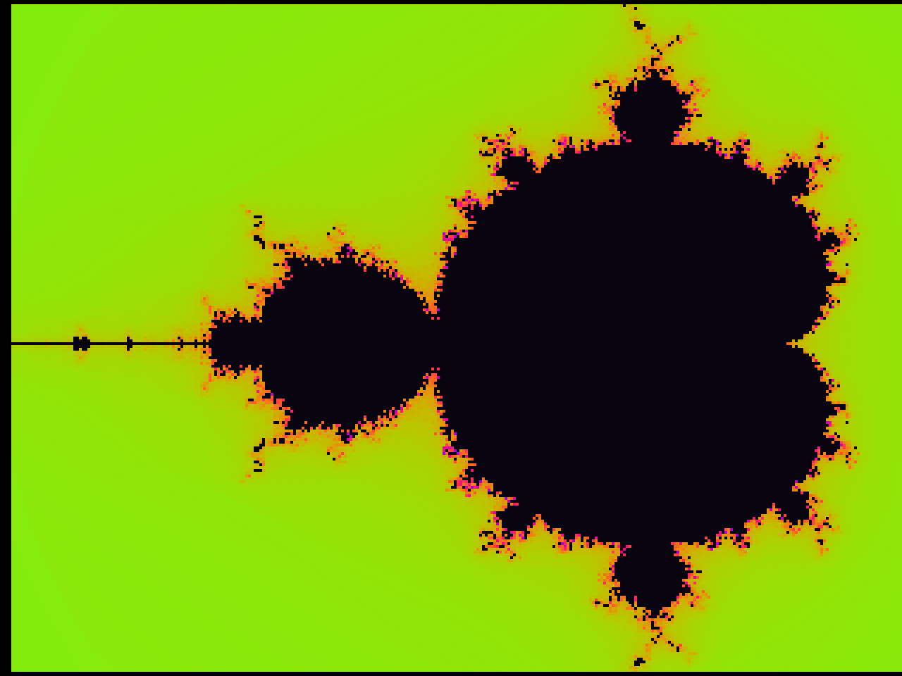

# N64 RSP Mandelbrot

Mandelbrot escape-time rendering computed entirely on the Nintendo 64 **RSP vector
unit** — a custom ucode running 8 pixels per vector op in q11 fixed point, validated
pixel-exact against a CPU reference under the [ares](https://github.com/ares-emulator/ares)
emulator's headless test runner.



*(320×240 captured from ares, upscaled 2×; smooth-cycle rainbow palette)*

## What's here

| Path | What |
|---|---|
| `mandel/main.c` | CPU side: stage packing, DMEM upload, readback, verify pass, mirroring paint, palette/smooth LUTs, direct ISViewer debug channel |
| `mandel/rsp_mandel.S` | the custom RSP ucode (q11 fixed point, `vmudm` exact squares, VCO borrow-chain escape freeze) |
| `mandel/test/probe.js` | headless test script for the ares-64 `ares-test` JS runner |
| `mandel/DESIGN.md` | original ucode design spec |
| `tools/n64test_ares.sh` | xvfb harness for official Ares captures |

## The ucode

RSP vectors are 128 bits = **8 lanes of signed 16-bit halfwords**, so the fractal
runs 8 pixels at a time in q11 fixed point (1.0 = 2048):

```
per iteration (8 pixels in parallel):
  zr² , zi²        = vmudm(|z|, |z|)        # exact (a·b)>>16, q11² → q6
  S                = zr² + zi²               # |z|² · 64
  escape?          = S >= 256               # |z| >= 2, tested BEFORE update
  2·zr·zi          = (zr+zi)² − zr² − zi²  # keeps every vmudm operand ≥ 0
  z'               = (S_re << 5) + c        # q6 → q11 back-shift
  escaped lanes FREEZE (mask via VCO borrow chain), counter stops
```

Optimizations in use:
- **real-axis mirroring** — the set is symmetric, only `ci ≥ 0` rows are computed
  (121 of 240), each painted twice
- **smooth coloring** — the ucode also emits the exact escape radius `S`; the CPU maps
  it through a 32 K-entry `log₂log` LUT → continuous palette coordinate, no per-pixel logs
- precomputed coordinate/palette LUTs, escape-freeze lane masking, single DMA readback

## Validation

Every pixel is cross-checked against a CPU q11 reference that mirrors the ucode's
exact semantics (truncating shifts, saturating adds). The ROM reports `mism=0` over
the ISViewer debug channel at boot and every 30 frames:

```
[probe] f=0 mism=0 min=1 max=60 rsp_ms=500 pack_ms=6 paint_ms=33
```

(`rsp_ms` is ares' *scalar interpreter* running all 121 rows; real RSP hardware is
substantially faster.)

## Headless testing (ares-test)

The [HailToDodongo/ares-64 fork](https://github.com/HailToDodongo/ares-64) adds a
JavaScript-scripted CLI runner that needs no window, GPU, or audio device:

```sh
cmake --preset linux-headless && cmake --build build_headless --target ares-test
ares-test mandel/test/probe.js mandel/mandel.z64 shot.png --timeout 280
```

With `setRenderer("none")` it skips RDP entirely and scans out whatever the ROM wrote
to RDRAM — a perfect match for this ROM's direct-framebuffer writes.

## Build

Needs [libdragon](https://github.com/DragonMinded/libdragon) with the N64 toolchain:

```sh
cd mandel && make          # → mandel.z64
```

On official Ares: `ares --setting Developer/HomebrewMode=True mandel.z64`

## RSP gotchas learned (documented the hard way)

- **`vabs` is three-operand**: `vd = vs<0 ? −vt : vt`. A two-operand libdragon macro
  call leaves `vt=$v0` → result is *always zero*.
- **`vmudh` = `sat16(full product)`** on real hardware (and in ares/CXD4 — their
  interpreters agree). It does **not** do `>>16`. Squaring q12 values with it silently
  clamps at 32767. The correct fractional shift is `vmudm(|a|,|b|)` — but `vt` is
  *unsigned*, so take absolute values first.
- **`lhv`/`shv` are stride-2 gather/scatter**, not contiguous arrays — use `lqv`/`sqv`
  for contiguous halfwords.
- Plain `vsub` consumes and clears VCOL; use `vsubc` to preserve the borrow.
- SGI's RSP assembly guide multiply table describes where partial products *land in
  the accumulator* — easy to misread as the `vd` result. Every accurate emulator
  reproduces the hardware; the guide is the trap.

## License

Same terms as libdragon samples (public-domain-ish); the ucode and CPU code here are
unlicense-style: do whatever.
